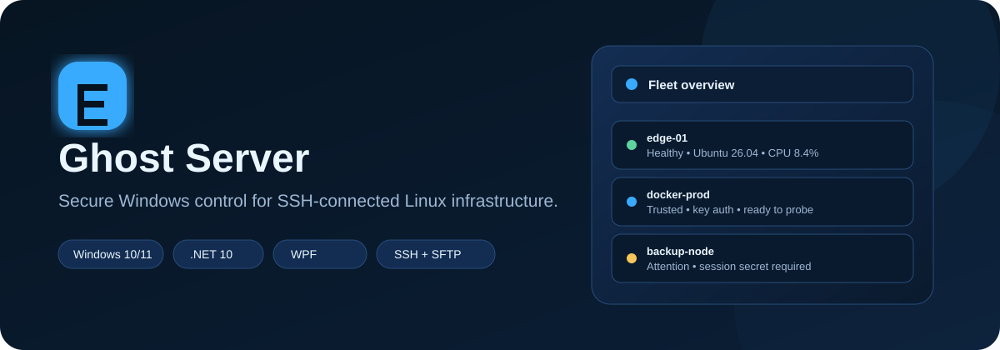
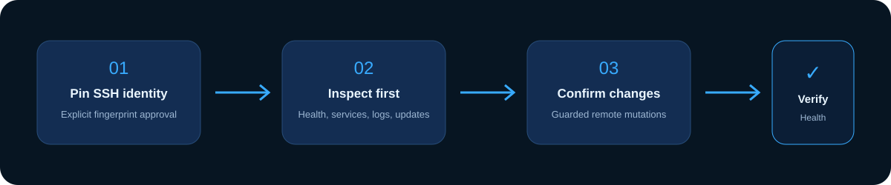
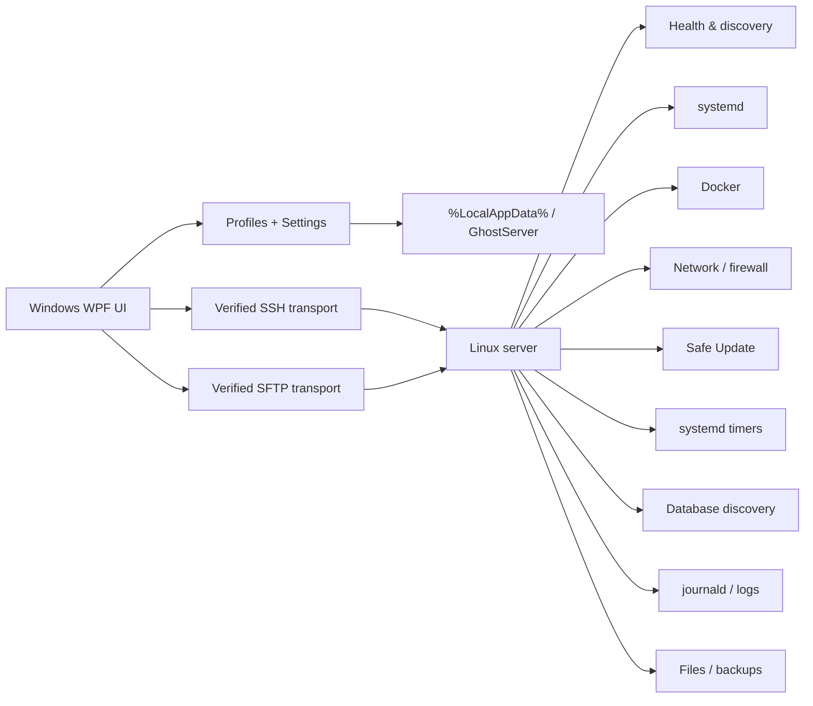

<div align="center">



<br>

[](https://github.com/bren-wp/Ghost-Server/releases/latest)
[](https://github.com/bren-wp/Ghost-Server/actions/workflows/ci.yml)
[](https://dotnet.microsoft.com/)
[](https://www.microsoft.com/windows/)
[](LICENSE)

# Ghost Server

### Secure Windows control for SSH-connected Linux infrastructure.

Manage servers, services, Docker, files, logs, updates, scheduled tasks and fleet health from one focused Windows desktop application — without turning routine operations into a terminal-only workflow.

[**Download Setup**](https://github.com/bren-wp/Ghost-Server/releases/latest/download/GhostServer-Setup.exe)
&nbsp;&nbsp;•&nbsp;&nbsp;
[**Download Portable**](https://github.com/bren-wp/Ghost-Server/releases/latest/download/GhostServer-Portable.exe)
&nbsp;&nbsp;•&nbsp;&nbsp;
[**View Releases**](https://github.com/bren-wp/Ghost-Server/releases)

</div>

---

## ✨ Why Ghost Server?

Ghost Server is built for people who manage Linux servers from Windows and want **direct control without sacrificing visibility or safety**.

Instead of hiding SSH behind a generic web dashboard, Ghost Server keeps the connection model explicit:

- 🔐 **Pinned SSH identity** — first connection requires fingerprint approval.
- 🧠 **Session-only secrets** — passwords and passphrases are not stored in server profiles.
- 🖥️ **Focused Windows UI** — native WPF application, no browser shell and no WebView application layer.
- ⚡ **Fast operations** — jump from Fleet health to a single server, inspect state, then act.
- 🛡️ **Guarded mutations** — disruptive actions require explicit confirmation.
- 📦 **Real release artifacts** — every release ships both Portable and Setup builds.
- ✅ **Production QA gates** — analyzers, source hygiene, installer verification and runtime smoke tests are mandatory.

---

## 🚀 Current release — 0.22.0

Ghost Server 0.22.0 focuses on **durable local state, race-safe interaction and narrow-window reliability**.

### New in 0.22.0

- 🔐 Profile save/delete, SSH trust changes, profile import, Fleet-history writes and remote administrative mutations are mutually coordinated.
- 🧱 Duplicate clicks cannot start overlapping profile or Fleet-history mutations.
- ↩️ Failed profile/Fleet persistence restores the previous in-memory state instead of leaving UI state ahead of disk.
- 🧷 SSH host-key approval stays pending until the pinned fingerprint is durably written; failed writes restore the previous trust state.
- 🕒 Successful connections no longer become false connection failures when only LastConnectedUtc persistence fails.
- 🔒 Session lock cancels an in-flight terminal connection, waits for the terminal transition to settle, then explicitly disconnects the shell.
- 🪟 Reset window size is transactional and restores prior geometry/settings when settings persistence fails.
- 📊 Fleet, Alerts and Trends summary cards switch from four to two columns at the tight responsive breakpoint.
- 🧩 Shared Ghost summary-card typography keeps long labels readable at the 640×440 minimum window size.
- ✅ Existing 0.21.0 administrative-operation safety, transactional profile import and portable-profile security remain enforced.


---

## 🧭 Product workspaces

| Workspace | What it does | Mutation level |
|---|---|---|
| 🏠 **Dashboard** | Live host health, OS, kernel, uptime, CPU, RAM, disk, load and running services | Read-only |
| 🌐 **Fleet** | Multi-server inventory, filtering, trust state, live health probes and fast Dashboard jump | Read-only |
| 🔔 **Alerts** | Local Fleet incidents, acknowledgement, server jump and CSV export | Local-only |
| 📊 **Trends** | Compare recent local Fleet CPU/RAM/disk history and export the comparison | Local-only |
| 📁 **Files** | Browse, upload and download over verified SFTP | Controlled file transfer |
| ⚙️ **Services** | Inspect, start, stop and restart systemd services | Confirmed remote change |
| 🐳 **Docker** | Inspect containers and start/stop/restart selected workloads | Confirmed remote change |
| 🔌 **Network** | Interfaces, routes, listening sockets and firewall state | Read-only + explicit allow rule |
| 🛡️ **Safe Update** | Preview updates, create config backup, upgrade and verify host health | Guarded maintenance flow |
| 💾 **Backup** | Create and download allowlisted configuration snapshots | Guarded snapshot workflow |
| 🕒 **Tasks** | Manage isolated Ghost Server systemd timers and inspect current-user crontab | Guarded scheduler changes |
| 🧠 **System** | Process inventory, filesystems, block devices, sessions and load | Read-only + confirmed SIGTERM |
| 🗄️ **Databases** | PostgreSQL, MySQL/MariaDB and SQLite discovery with database-name visibility where non-interactive local auth is already available | Read-only |
| 📜 **Logs** | Server, service and Docker logs with client-side filtering | Read-only |
| ⌨️ **Terminal** | Persistent line-oriented SSH shell with history and insert-only presets | User-controlled |
| 🔒 **Security** | Baseline read-only server security checks | Read-only |
| 🛠️ **Settings** | Monitoring cadence, backup folder, profile import/export and app data | Local settings |

---

## 🌐 Fleet management

Fleet gives you one place to review every saved server profile without introducing dangerous bulk administration.

- Filter by server name, endpoint, username, health or operating system.
- See **Saved / Trusted / Healthy / Attention** counters immediately.
- Restore the last known local health state after restarting Ghost Server.
- Inspect up to 100 recent local probe records for the selected server.
- Flag CPU, RAM or disk utilization at 90%+ as local Attention.
- Run parallel read-only probes against trusted private-key profiles.
- Probe a selected password/passphrase-protected server using a **session-only secret**.
- Jump directly from a Fleet row to the normal single-server Dashboard workflow.

> Ghost Server deliberately does **not** expose bulk restart, update, firewall or terminate actions in Fleet.

---

## 🛡️ Safe Update

Package maintenance is treated as a workflow, not a single dangerous button.

1. Preview available updates.
2. Create and download a configuration snapshot.
3. Run the supported package-manager update.
4. Re-check health after the update.
5. Keep reboot decisions explicit.

Supported discovery/update paths cover common Linux package managers including **APT, DNF, YUM, Zypper and pacman**.

Ghost Server does not silently reboot a server after updates.

---

## 🔐 Security model



### SSH identity

Ghost Server fails closed around server identity:

- unknown host keys require explicit approval;
- pinned SHA-256 fingerprints are stored with the profile;
- a changed fingerprint blocks remote operations;
- resetting trust is an explicit local action.

### Secrets

Passwords and private-key passphrases are **session-only**.

Ghost Server profile export/import contains connection metadata, but not session secrets.

### Remote administration

Administrative changes are intentionally narrow:

- service and Docker stop/restart actions require confirmation;
- firewall mutations validate TCP/UDP and port range;
- process termination accepts the selected numeric PID and sends **SIGTERM only**;
- Ghost Server never escalates automatically to SIGKILL;
- read-only discovery remains separate from mutation controls.

### Local diagnostics

Unexpected runtime failures can write bounded local crash diagnostics under the Ghost Server app-data directory. Crash logging is best-effort and does not replace the original failure path.

See [SECURITY.md](SECURITY.md) for the current security boundaries.

---

## ⌨️ Persistent interactive terminal

Ghost Server 0.15.0 keeps one verified SSH shell open for the selected server until you explicitly disconnect or a security/lifecycle boundary closes it.

- **Connect shell** opens the persistent session only after the profile has an approved host-key fingerprint.
- **Send** writes the reviewed command into that existing shell.
- Working directory, exported environment values and normal shell state persist between commands.
- **Disconnect** closes the shell without changing the remote server.
- Switching servers, editing/deleting the active profile, resetting SSH trust, locking the session or closing Ghost Server disposes the shell automatically.
- Terminal output is local and bounded in memory.

The terminal is intentionally **line-oriented** in this release. Ghost Server does not claim full-screen terminal-emulator behavior for tools such as `vim`, `less` or interactive `top`.

### Quick Commands

The preset library remains inspection-oriented:

- **System summary**
- **Top processes**
- **Listening sockets**
- **Disk usage**
- **Docker containers**
- **Recent journal errors**

Selecting a preset only inserts it into the editor. It is never sent until you press **Send**.


---

## ⚡ Keyboard shortcuts

| Shortcut | Action |
|---|---|
| **Ctrl + N** | Add server |
| **Ctrl + L** | Lock session and clear the active session secret |
| **F5** | Refresh the active workspace where supported |
| **Esc** | Close the active confirmation/add-server overlay |
| **↑ / ↓** | Browse Terminal command history |

---

## 🏗️ Architecture



### Technology

- **C# / .NET 10**
- **WPF**
- **SSH.NET 2026.0.0**
- **Inno Setup**
- **GitHub Actions**
- **Windows 10 / 11**

No browser application shell is used.

---

## 🎨 Ghost visual system

Ghost Server follows the visual language established across the Ghost product family:

| Token | Value |
|---|---|
| Electric Blue | `#38ABFF` |
| Deep Navy | `#0B1E36` |
| Slate Blue | `#132D52` |
| Ice White | `#EAF6FF` |
| Title bar | 51 px |
| Navigation rail | 216 px |

The UI uses dark navy surfaces, restrained blue emphasis, thin borders, Fluent iconography and readable high-contrast text.

---

## 📦 Download

### Installer

Recommended for normal Windows use.

**[Download GhostServer-Setup.exe](https://github.com/bren-wp/Ghost-Server/releases/latest/download/GhostServer-Setup.exe)**

The Setup build is validated in CI through:

- silent installation;
- installed executable discovery;
- launch smoke test;
- silent uninstall.

### Portable

Runs as a self-contained Windows x64 executable.

**[Download GhostServer-Portable.exe](https://github.com/bren-wp/Ghost-Server/releases/latest/download/GhostServer-Portable.exe)**

### Verify downloads

Every release publishes:

**[SHA256SUMS.txt](https://github.com/bren-wp/Ghost-Server/releases/latest/download/SHA256SUMS.txt)**

**[BUILD-PROVENANCE.txt](https://github.com/bren-wp/Ghost-Server/releases/latest/download/BUILD-PROVENANCE.txt)**

The provenance file records the validated commit, Windows CI run and SHA-256 hashes. Release publication does not rebuild the Windows binaries; it publishes the exact CI artifact that passed the Portable and Setup smoke tests.

Use PowerShell:

```powershell
Get-FileHash .\GhostServer-Setup.exe -Algorithm SHA256
Get-FileHash .\GhostServer-Portable.exe -Algorithm SHA256
```

Compare the result with the checksum manifest from the same GitHub release.

---

## 🧪 Release quality gate

A Ghost Server release is not considered deliverable until the validated `main` commit passes the Windows pipeline.

The mandatory gate includes:

1. version metadata consistency;
2. release-notes presence;
3. source-hygiene audit for unfinished markers;
4. package restore;
5. .NET analyzers with warnings treated as errors;
6. Release build;
7. self-contained Windows x64 publish;
8. Portable EXE creation and verification;
9. Inno Setup installer creation and verification;
10. Portable launch smoke test;
11. Setup install → launch → uninstall smoke test;
12. upload of the smoke-tested Windows release artifact;
13. release-workflow provenance contract validation;
14. final GitHub Release publication from that exact validated CI artifact;
15. SHA-256 checksum and build-provenance manifest generation.

The release workflow is triggered only after a successful `main` CI run.

---

## 🧰 Build from source

### Requirements

- Windows 10 or Windows 11
- .NET 10 SDK

### Build

```powershell
git clone https://github.com/bren-wp/Ghost-Server.git
cd Ghost-Server

dotnet restore GhostServer.sln
dotnet build GhostServer.sln -c Release
dotnet run --project src/GhostServer/GhostServer.csproj
```

### Self-contained publish

```powershell
dotnet publish src/GhostServer/GhostServer.csproj `
  -c Release `
  -r win-x64 `
  --self-contained true `
  -p:PublishSingleFile=true `
  -p:IncludeNativeLibrariesForSelfExtract=true
```

---

## 🗂️ Project structure

```text
Ghost-Server/
├─ .github/workflows/       Windows CI + release publication
├─ build/                   build-time branding helpers
├─ docs/
│  ├─ assets/               README/product artwork
│  └─ releases/             versioned release notes
├─ installer/               Inno Setup definition
├─ src/GhostServer/
│  ├─ Models/
│  ├─ Services/
│  ├─ Themes/
│  ├─ App.xaml
│  ├─ MainWindow.xaml
│  └─ MainWindow.xaml.cs
├─ SECURITY.md
├─ version.json
└─ GhostServer.sln
```

---

## 🧭 Product direction

Ghost Server is moving toward a complete Windows operations console for SSH-managed Linux infrastructure.

Current priorities after 0.22.0:

- 🗄️ guarded database maintenance tooling built on top of the read-only discovery layer;
- 🔔 optional user-configured notification channels built on the local Alert Center;
- 📊 richer local trend visualization and time-window analysis;
- 🔏 signed Windows distribution;
- 🧪 broader automated operational regression tests.

The product direction stays conservative around dangerous bulk operations: **visibility first, confirmation before mutation, verification after change**.

---

## 🤝 Contributing

Pull requests should keep the existing product constraints intact:

- no fake production metrics or seeded demo servers;
- no persisted server passwords or passphrases;
- no silent SSH trust;
- no weakening analyzer or CI gates to make a build pass;
- no release that only changes the version number;
- no merge while required Windows CI is failing.

Please keep changes focused and include release documentation when behavior changes.

---

## 📄 License

See [LICENSE](LICENSE).

---

<div align="center">

**Ghost Server**  
Windows control. Linux infrastructure. Explicit trust.

[Releases](https://github.com/bren-wp/Ghost-Server/releases)
&nbsp;•&nbsp;
[Security](SECURITY.md)
&nbsp;•&nbsp;
[UI / UX](docs/UI_UX.md)

</div>
